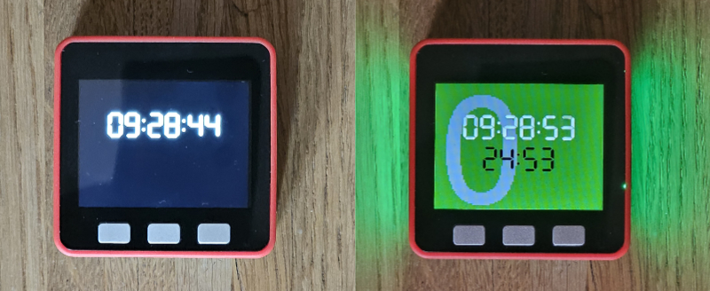

# Aww, Pomodoro!



A simple pomodoro timer for M5Stack Core2 devices.

## Hardware

- M5Stack Core2 or compatible (e.g. FIRE)
- (optional) M5Stack FIRE or M5Stack Core2 with M5GO Battery Bottom2 + SK6812 Led Strip (connected to port B)
- small SD card (e.g. 16GB) for configuration file

## Features

- Three button interface:
  - `A` - Start/Stop timer.
  - `B` - Extend work time.
  - `C` - Cancel work time / Skip break time.
- "Gong" sound at the end of each work/break period.
- INI file configuration on SD Card.
- Network time synchronization.

## Configuration

Create a `config.ini` file on the root of your SD Card with the following content (for CET timezone):

```ini
[wifi]
ssid=your wifi ssid
pass=your wifi password

[ntp]
host=your ntp host (e.g. your router) or pool.ntp.org
tz=CET-1CEST,M3.5.0,M10.5.0/3

[http]
host=your backend host or ip
port=8080

[flavors]
flavor0=work
flavor1=leisure
flavor2=chores
```

## HTTP notifications

Pomodoro transitions are queued on the SD card in `/queue` and sent in chronological order.
The REST endpoint is `POST /pomodoros/{start_time}/transitions` with a JSON body that includes
`transition`, `start_time`, `event_time`, and `work_flavor` (string label).

To run the reference backend locally:

```sh
python3 tools/http_backend.py
```
